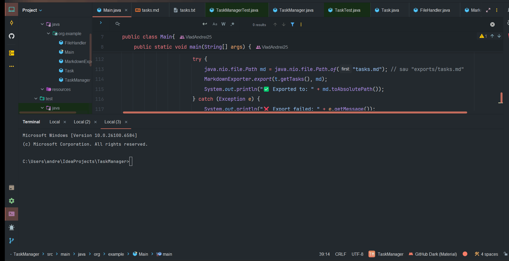
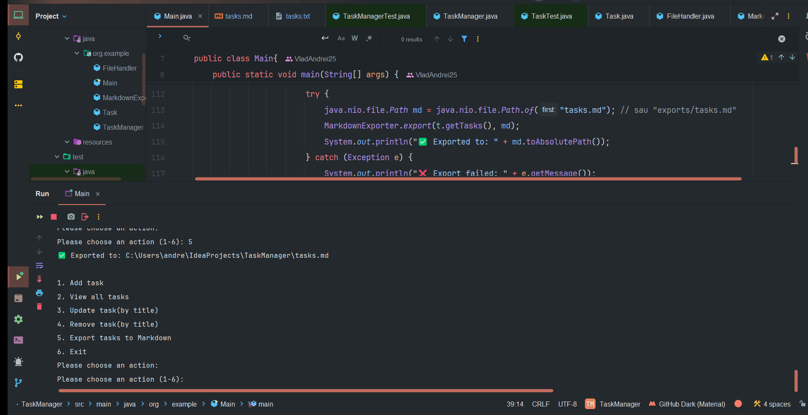
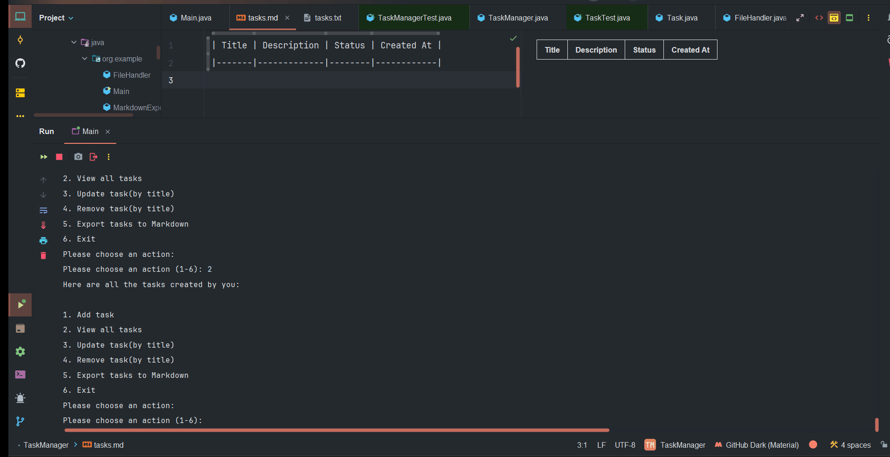

<p align="center">
  
</p>

# 🧩 Task Manager App

A simple yet efficient **console-based task management application** built with **Java 17**.  
It allows users to **add, update, remove, list, and export** tasks, while automatically saving changes locally.

---

## 🚀 Project Overview

The **Task Manager App** provides an interactive CLI for managing daily tasks.  
All operations are reflected in a local file (`tasks.txt`), and users can export their task list in Markdown format (`tasks.md`).

The project demonstrates:
- File handling in Java (`FileHandler`)
- Object-oriented design (`Task`, `TaskManager`)
- Data persistence (via text files)
- Markdown report generation
- Unit testing using **JUnit 5**

---

## 🧰 Tech Stack


| Tool / Library | Purpose |
|----------------|----------|
| **Java 17** | Main programming language |
| **JUnit 5** | Unit testing framework |
| **Maven** | Build automation & dependency management |
| **MarkdownExporter** | Exports tasks to `.md` file |
| **FileHandler** | Handles reading/writing to `tasks.txt` |

---

## ⚙️ Project Structure
```bash
task-manager-app/
├── src/
│   ├── main/
│   │   └── java/
│   │       ├── FileHandler.java
│   │       ├── MarkdownExporter.java
│   │       ├── Task.java
│   │       ├── TaskManager.java
│   │       └── Main.java
│   │
│   └── test/
│       └── java/
│           ├── TaskTest.java
│           └── TaskManagerTest.java
│
├── tasks.txt
├── tasks.md
├── pom.xml
├── .gitignore
└── README.md
```

---

## 🧠 Main Features
| Feature                | Description                                    |
| ---------------------- | ---------------------------------------------- |
| ➕ **Add Task**         | Add new task with title and description       |
| ✏️ **Update Task**     | Edit existing tasks                            |
| ❌ **Remove Task**      | Delete task by ID                             |
| 📋 **List Tasks**      | Display all tasks in console                   |
| 💾 **Auto-Save**       | Every action updates `tasks.txt` automatically |
| 📤 **Export Markdown** | Generate a formatted `tasks.md` report         |
| 🧪 **Unit Tested**     | Core classes tested with JUnit 5               |

---

## 🧪 How to Run Tests
1. Just press *Shift+F10* on the test you want to run
   OR
1. **Run all tests using Maven:**
   ```
   mvn test
   ```
2. **Run a specific test class:**
   ```
   mvn -Dtest=TaskManagerTest test
   ```

---

## 🧾 Classes Overview
| Class                     | Description                          |
| ------------------------- | ------------------------------------ |
| **Main.java**             | Entry point for the console menu     |
| **Task.java**             | Defines the Task object structure    |
| **TaskManager.java**      | Manages CRUD operations on tasks     |
| **FileHandler.java**      | Reads and writes data to `tasks.txt` |
| **MarkdownExporter.java** | Exports the tasks into `tasks.md`    |
| **TaskManagerTest.java**  | Unit tests for TaskManager logic     |
| **TaskTest.java**         | Unit tests for Task entity behavior  |

---

## 📸 Screenshots
Example of successful test execution in TaskManagerTest:
<p align="center">
  
</p>
Example of succesful test execution in TaskTest:
<p align="center">
  
</p>
Example of succesful upload from FileHandler in tasks.txt:
<p align="center">
  
</p>
Example of succesful upload from MarkdownExporter in tasks.md:
<p align="center">
  
</p>

---

## 🎥 Demo – Application Execution

<div align="center">

### 🟢 Add Task


### 🔴 Remove Task


### 📋 View All Tasks


</div>


---

## 💡 Future Improvements
🔁 Add sorting & filtering (by status or date)

🗓️ Add task deadlines and priorities

🧩 Add JSON export option

🧾 Integrate logging with SLF4J

🧠 Add persistence using SQLite

📦 Add CI/CD pipeline (GitHub Actions)

---

### 🧾 License

This project is licensed under the [MIT License](LICENSE)

---

## 👤 Author
Radulescu Vlad Andrei

📧 GitHub Profile: [https://github.com/VladAndrei25]

💬 Feel free to reach out for collaboration or feedback!

---
